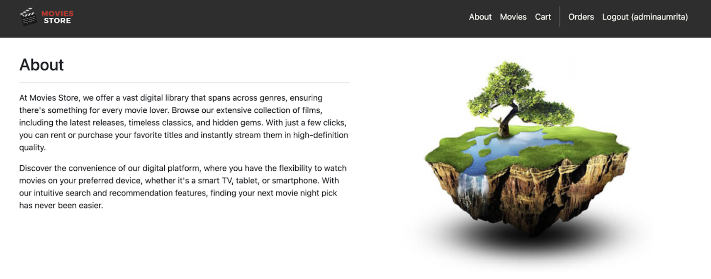
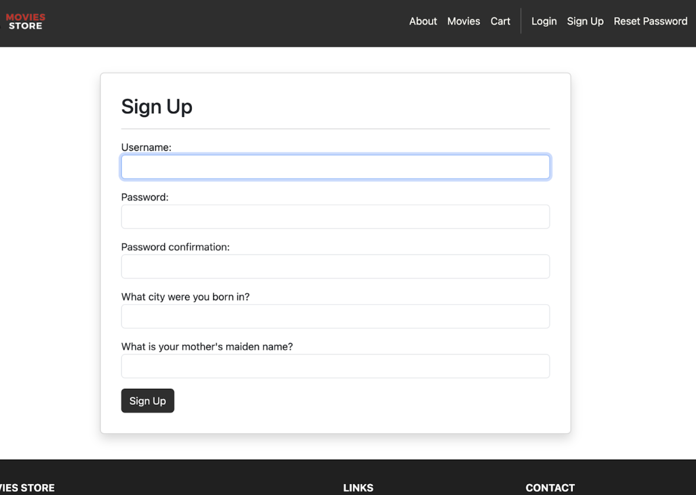
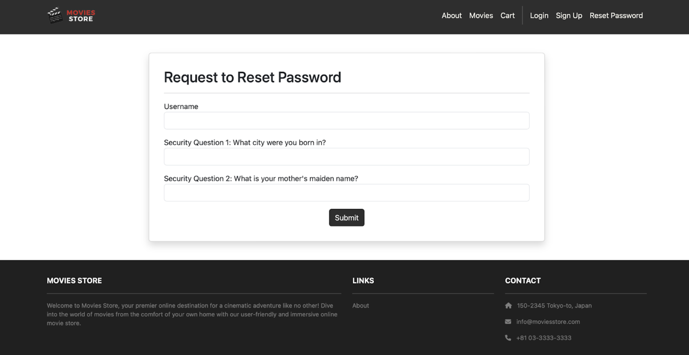
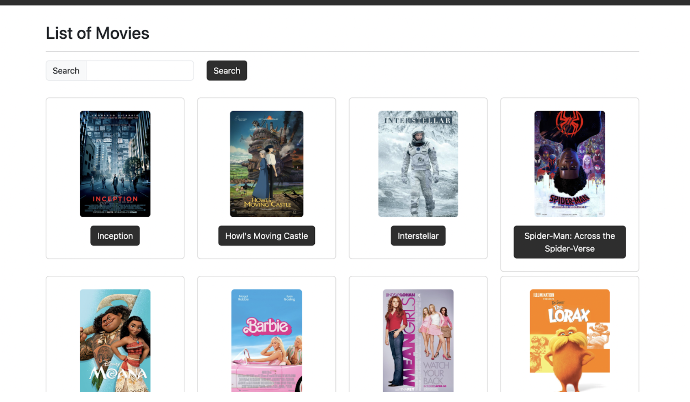
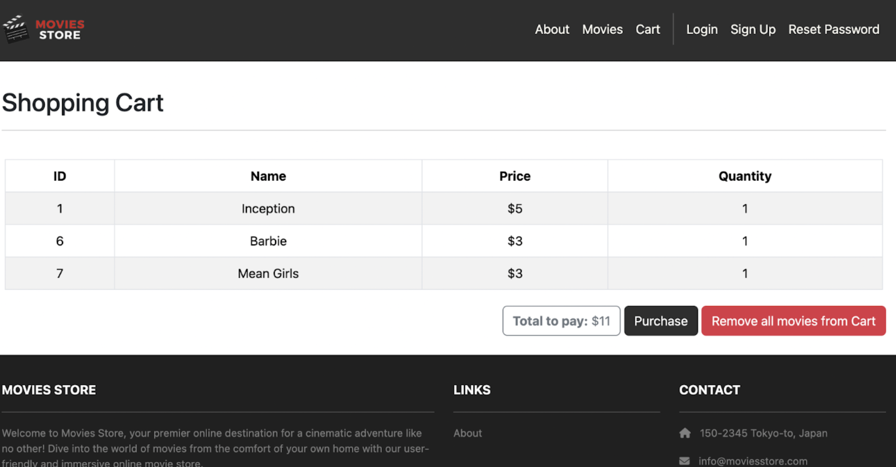
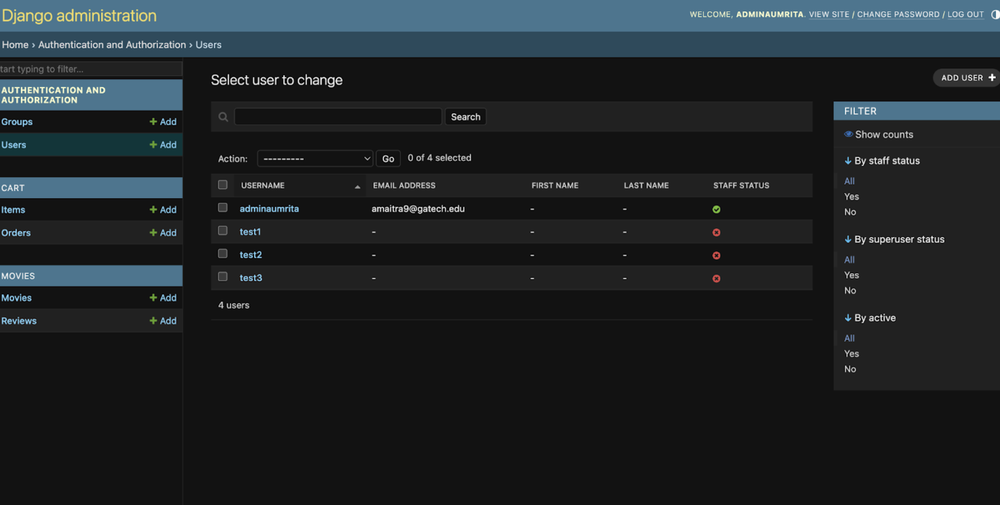

# Georgia Tech Movies Store 🎬

## 🤝 Contributers

Saloni Agshiker, Sriya Thota, Hannah Schemmel, Aumrita Maitra, Nimrath Khanuja | CS 2340 (Objects & Design), Spring 2025

***

## 🎯 What it Does

GT Movie Store is a full-stack web app that enables users to browse, search, and purchase movies through a structured, user-friendly interface. The platform provides comprehensive metadata and user-generated reviews for each title. It also includes an administrative backend that supports CRUD operations for users, movies, reviews, and orders, ensuring data integrity and up-to-date content management.

***

## 🛠 How we Built it

The application is built in Python using the Django framework following the Model–Template–View (MTV) architecture. It uses a SQLite database to manage user/admin data and store movie data (images, description, review).

***

## 📽 Demo

